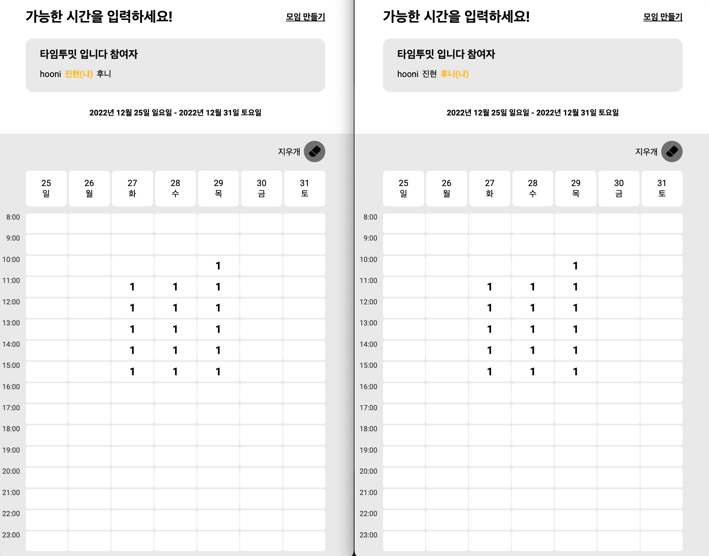

# 타임투밋 

[타임투밋](https://www.time2meet.xyz/)은 실시간으로 일정 조율을 할 수 있는 웹 기반 어플리케이션 입니다.

1. 일정 공유 링크를 생성합니다.
2. 생성된 링크를 카카오톡을 통해 공유합니다.
3. 공유 받은 링크에 접속해 실시간으로 가능한 시간을 입력합니다.

 

## 기술 스택

- TypeScript
- Nextjs
- Firebase
- React hook form
- emotion
